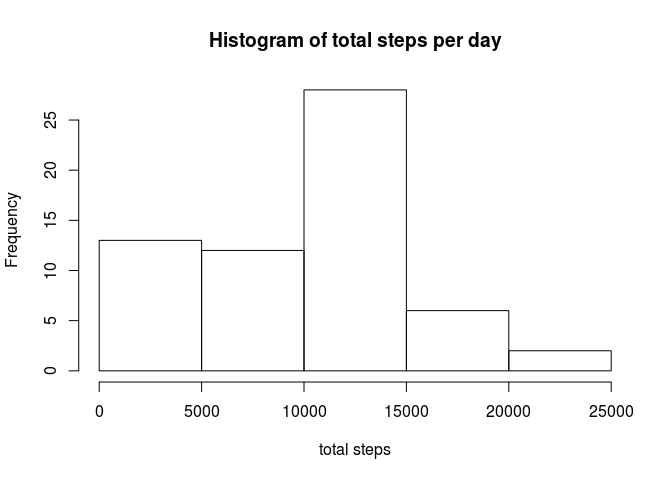
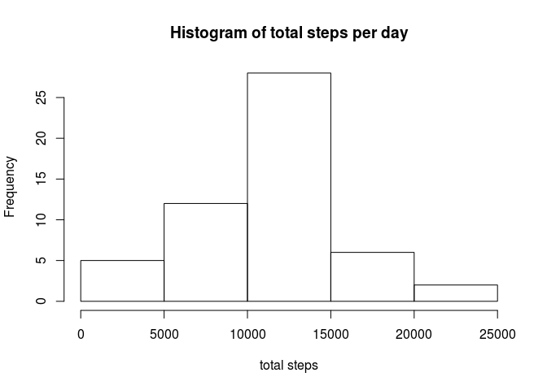
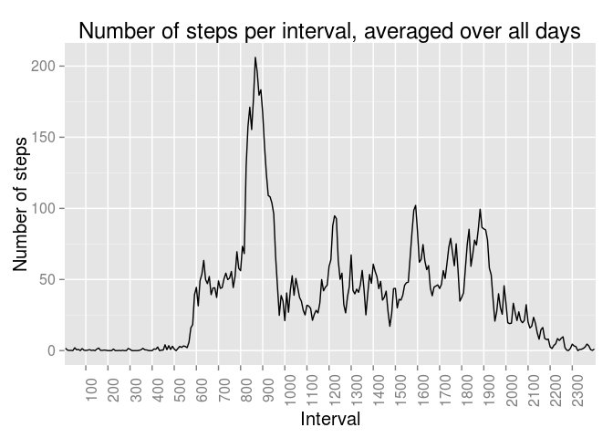
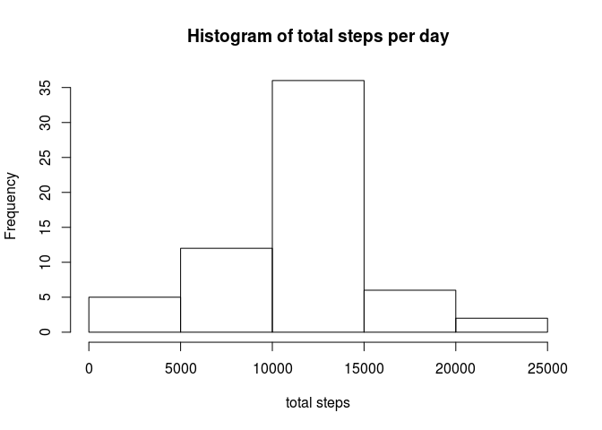
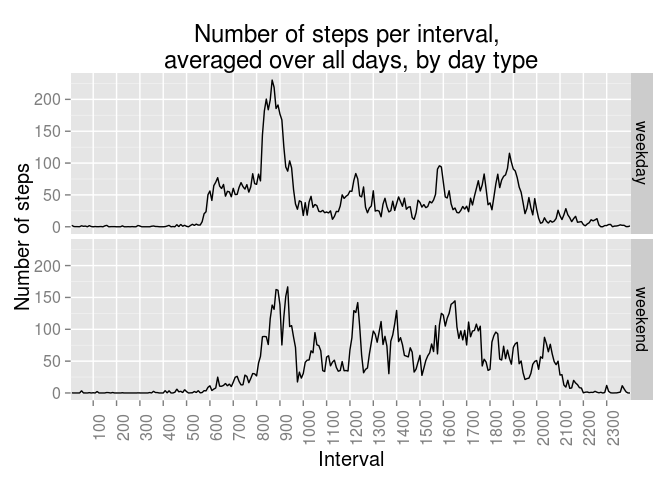

# Reproducible Research: Peer Assessment 1


## Loading and preprocessing the data

With read.csv we load the data and set column classes to be as desired.


```r
activity_data <- read.csv("activity.csv", header = TRUE, na.strings = "NA", colClasses = c("numeric", "Date", "integer"))
str(activity_data)
```

```
## 'data.frame':	17568 obs. of  3 variables:
##  $ steps   : num  NA NA NA NA NA NA NA NA NA NA ...
##  $ date    : Date, format: "2012-10-01" "2012-10-01" ...
##  $ interval: int  0 5 10 15 20 25 30 35 40 45 ...
```

Just to corroborate that the only missing values lie in the **steps** column we find out the number of missing values per column:


```r
apply(activity_data, FUN = function(col){sum(is.na(col))}, MARGIN = 2)
```

```
##    steps     date interval 
##     2304        0        0
```

Let's briefly see how the missing values distribute within days. It turns out that for each day, either all measurements were taken, or non at all. For 53 days all measurements were taken, and for 8, none at all (there are 288 measurements per day, as each day has 24 * 60 / 5 = 288 5-minute intervals).


```r
table(tapply(activity_data$steps, activity_data$date, FUN = function(x){sum(is.na(x))}), dnn = c("Number of missing measurements"))
```

```
## Number of missing measurements
##   0 288 
##  53   8
```

A special note should be made about the **interval** variable. At fist sight it appears to be an integer/numeric variable which increases steadily by 5. However, closer inspection reveals it does not behave as such. Indeed, the **interval** variable actually represents a Hour-Minute pair, so for example the interval 1450 referrs to the 5 minute interval starting at 14:50. This can be troublesome if we incurr in plotting the 5 minute interval on the x-axis using its integer/numeric representation for spacing, because intervals like that from 12:55 to 13:00 will appear with length 45 instead of 5. We should therefore be careful when plotting interval on the x-axis. This will become aparent when plotting the average daily activity pattern.

## What is mean total number of steps taken per day?

There are several interpretations of what it means to *ignore the missing values in the dataset* (as the assignment statement indicates).

On one hand, we can use tapply to partition the data by date and then calculate the total number of steps per day removing NAs. Note that we do not remove NA values until we actually evaluate the total number of steps per day. This results in days with no step measurement at all to still be taken into consideration in the plot, thus accounting in our histogram for 0 total steps. This explains the unusual peak at 0-5000 range in our histogram, since we would expect the data to be more normally distributed.


```r
total_steps_per_day <- tapply(activity_data$steps, INDEX = activity_data$date, FUN = sum, na.rm = TRUE)
hist(total_steps_per_day, main = "Histogram of total steps per day", xlab = "total steps")
```

 

For the mean and median number of steps per day:


```r
summary(total_steps_per_day)
```

```
##    Min. 1st Qu.  Median    Mean 3rd Qu.    Max. 
##       0    6778   10400    9354   12810   21190
```

On the other hand, we can remove NA values *before* partitioning the data by days. This results in days with no measurements never being takein into considered for plotting the total number of steps per day, and the remaining days are those with all measurements taken. We obtain the following:


```r
# We will use the dplyr package to filter the rows with non-missing step values
library("dplyr")
activity_subset <- filter(activity_data, !is.na(steps))
total_steps_per_day <- tapply(activity_subset$steps, INDEX = activity_subset$date, FUN = sum, na.rm = TRUE)
hist(total_steps_per_day, main = "Histogram of total steps per day", xlab = "total steps")
```

 

For the mean and median number of steps per day:


```r
summary(total_steps_per_day)
```

```
##    Min. 1st Qu.  Median    Mean 3rd Qu.    Max. 
##      41    8841   10760   10770   13290   21190
```

## What is the average daily activity pattern?

To make the time series plot of the 5-minute interval (x-axis) and the average number of steps taken, averaged across all days (y-axis), recall what we said a the very beginning: that we should be extra careful about spacing on the x-axis. We cannot simply plot the **interval** variable on the x-axis or else we will obtain unusual spacing in the time interval X:55 to (X+1):00. We will use ggplot2 for convenience.  

First, we calculate the mean number of steps for each 5 minute interval, averaged over all days, which will be the y-values of our plot:


```r
steps_per_interval_averaged_over_days <- tapply(activity_data$steps, activity_data$interval, mean, na.rm = TRUE)
```

We build the data frame to be used with ggplot2 to produce the diagram. On the x-axis we simply indicate 288 ticks (which is the number of 5 minute intervals in a day).


```r
df <- data.frame(x = 1:288, y = steps_per_interval_averaged_over_days)
```

Now we do the plot. We label with x-axis ticks at every hour, which corresponds to putting and labeling breaks at the x-axis every 12 units.


```r
library("ggplot2")
p <- ggplot(df, aes(x = x, y = y))
p <- p +
    geom_line() +
    scale_x_discrete(breaks = seq(0, 287, by=12), labels = seq(0,2300,by=100)) +
    xlab("Interval") +
    ylab("Number of steps") +
    ggtitle("Number of steps per interval, averaged over all days") +
    theme(text = element_text(size=15), axis.text.x = element_text(angle=90, vjust=1))
p
```

 

To find the 5 minute interval which contains the maximum number of steps (on average over all days):


```r
activity_data$interval[which.max(steps_per_interval_averaged_over_days)]
```

```
## [1] 835
```

That is, 8:35 (AM).

## Imputing missing values

The number of missing values in the data (which we already saw before) is:


```r
sum(is.na(activity_data$steps))
```

```
## [1] 2304
```

As a strategy to fill out the missing values in the dataset, we fill them with the mean over all days:


```r
replace_by_mean_if_NA <- function(idx){
value = activity_data$steps[idx]
   interval_number = ((idx - 1) %% 288) + 1
   if(!is.na(value)){
       value
   }
   else{
       steps_per_interval_averaged_over_days[interval_number]
   }
}

activity_data$steps <- as.numeric(sapply(1:length(activity_data$steps), FUN = replace_by_mean_if_NA))
```

We remake the histogram of total number of steps per day. We obtain:


```r
total_steps_per_day <- tapply(activity_data$steps, INDEX = activity_data$date, FUN = sum)
hist(total_steps_per_day, main = "Histogram of total steps per day", xlab = "total steps")
```

 

As for mean and median number of steps per day:


```r
summary(total_steps_per_day)
```

```
##    Min. 1st Qu.  Median    Mean 3rd Qu.    Max. 
##      41    9819   10770   10770   12810   21190
```

We had made two previous mean and median calculations, each depending on when NA values were chosen to be removed. If we compare these new mean and median values with the first mean and median, they have gone up considerably, which is clear since in the first mean and median calculation, days with no measurements contribute as days with 0 total steps. However, these third mean and median values are almost the same as those from the second mean and median calculated. This is explained by the fact that for the second mean and median calculation, the mean and median are calculated over exactly the set of 53 days with complete measurements, and they cover exactly all the measurements (the other 8 days have no measurement at all). The NA values we have filled in for the third mean and median calculation result in adding 8 days equal to the 'average' of these 53 days. Doing this obviously leaves the mean unaltered, and may affect the median, but probably only slightly. This is exactly what we see in this third mean and median calculation (it is by no means a coincidence).

## Are there differences in activity patterns between weekdays and weekends?

In this section we will be making a time series plot of the 5-minute interval (x-axis) and the average number of steps taken, averaged across all weekday days or weekend days (y-axis).

To this end, first we create a new factor variable in the dataset with two levels -- "weekday" and "weekend" indicating whether a given date is a weekday or weekend day:


```r
is_weekend <- weekdays(activity_data$date) %in% c("Saturday","Sunday")
activity_data$daytype <- as.factor(sapply(is_weekend, FUN = function(x){if(x){"weekend"}else{"weekday"}}))
```

Now we partition the data frame into two data frames: one for weekdays and one for weekends. They appear as the first and second element of the list **activity_by_daytype**:


```r
activity_by_daytype <- split(activity_data, activity_data$daytype)
```

We calculate for each 5-minute interval in each data frame, the average number of steps taken, averaged across all those days:


```r
steps_per_interval_averaged_over_days_by_daytype <- lapply(activity_by_daytype, FUN = function(x){tapply(x$steps, x$interval, mean)})
```

We will be unsing ggplot2 to plot the 'average' weekday day against the 'average' weekend day, so we create a data frame with the desired varaibles. Each row has three variables: **steps**, **daytype**, **interval_idx**. Thus each observation (x,y,z) in the data frame accounts for the average number of steps x averaged across all days of type y for the interval z. To create this data frame, we build the columns separately:

For **steps**, we just concatenate the two vectors in steps_per_interval_averaged_over_days_by_daytype:


```r
steps <- c(steps_per_interval_averaged_over_days_by_daytype[[1]], steps_per_interval_averaged_over_days_by_daytype[[2]])
```

For **daytype**, we know the first 288 observations are from weekdays and the remaining 288 from weekends:


```r
daytype <- rep(c("weekday","weekend"), each = 288)
```

Finally, the **interval_idx** is just repeating the vector 1:288 twice:


```r
interval_idx <- rep(1:288, times = 2)
df <- data.frame(steps = steps, daytype = daytype, interval_idx = interval_idx)
```

With this data frame we make the desired plot:


```r
p <- ggplot(df, aes(x = df$interval_idx, y = df$steps))
p <- p + facet_grid(daytype ~ .) +
    geom_line() +
    scale_x_discrete(breaks = seq(0, 287, by=12), labels = seq(0,2300,by=100)) +
    xlab("Interval") +
    ylab("Number of steps") +
    ggtitle("Number of steps per interval, \naveraged over all days, by day type") +
    theme(text = element_text(size=15), axis.text.x = element_text(angle=90, vjust=1))
p
```

 

We can see the difference in activity between weekdays and weekends. Most notoriously, weekdays show a much more intense activity in the morning (from 5:30 AM to 8:00 AM) than weekends, which is reasonable as the subject probably wakes up earlier during weekdays.

As a last comment (you can freely ignore everything from this point on if you want), we can check out the data frame for the last plot is fine by doing the weighted average of the 'average' weekday day and the 'average' weekend day to see if we obtain the same plot as that for the 'average' day. The percentage of measurements corresponding to weekends can be calculated as:


```r
mean(is_weekend)
```

```
## [1] 0.2622951
```

So the average day, as a weighted average of the average weekday day and weekend day is:


```r
avg_day <- subset(df$steps, daytype == "weekend") * mean(is_weekend) + subset(df$steps, daytype == "weekday") * (1 - mean(is_weekend))
```

And if we plot this:

```r
df <- data.frame(x = 1:288, y = avg_day)
p <- ggplot(df, aes(x = x, y = y))
p <- p +
    geom_line() +
    scale_x_discrete(breaks = seq(0, 287, by=12), labels = seq(0,2300,by=100)) +
    xlab("Interval") +
    ylab("Number of steps") +
    ggtitle("Number of steps per interval, averaged over all days") +
    theme(text = element_text(size=15), axis.text.x = element_text(angle=90, vjust=1))
p
```

 

We obtain the same plot as the original. This confirms our data frame for the last plot was set up correctly.
